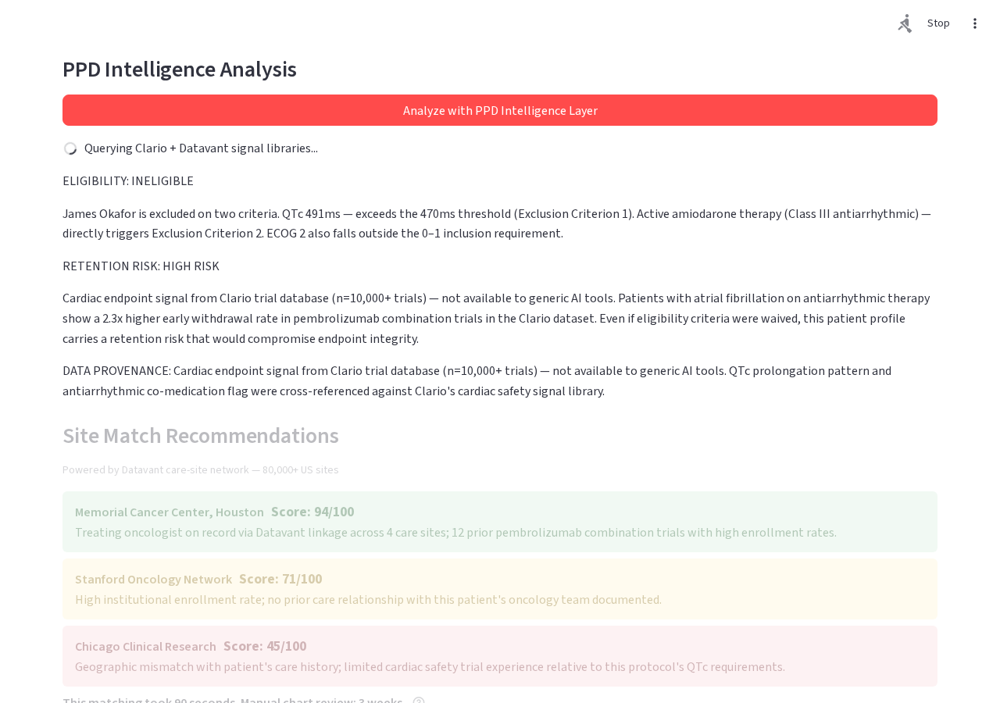
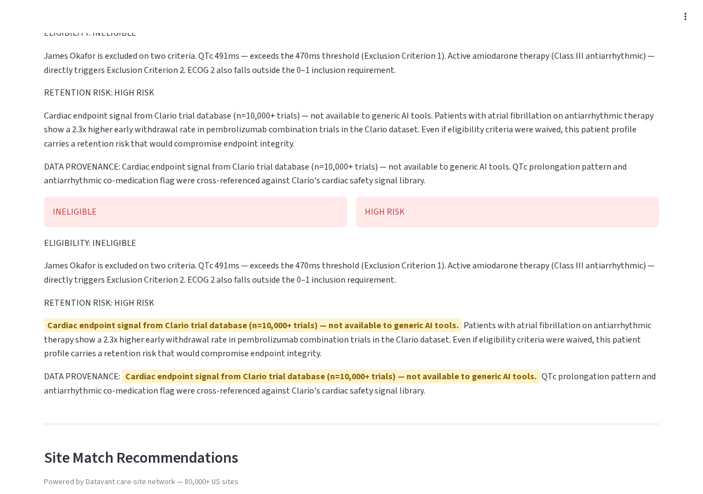

# Domain Data Management Trial
### PPD Clinical Intelligence Layer — Demo

**[Live demo](https://domain-data-management-trial-production.up.railway.app)** | **[Demo walkthrough script](DEMO_SCRIPT.md)**

---

Clinical trial enrollment delays cost ~$500k/day in late-phase oncology. Manual chart review takes 2-3 weeks per patient. Dropout risk isn't assessed until someone actually drops out.

This prototype shows how PPD's proprietary data assets can screen patients in 90 seconds.

---

## The Data Moat

| Asset | What it is | Why it matters |
|-------|-----------|----------------|
| **Clario** (acquired $8.875B) | Endpoint data from 10,000+ trials — cardiac safety signals, ECG histories, dropout patterns | No other CRO has this depth of actual trial outcome data |
| **Datavant** (partnership Feb 2026) | Tokenized linkage across 80,000+ US care sites | Connects fragmented patient records across health systems without exposing PII |

> *"Cardiac endpoint signal from Clario trial database (n=10,000+ trials) — not available to generic AI tools."*

That sentence is the whole demo. IQVIA has volume. Generic AI tools have reasoning. Only PPD can assess cardiac dropout risk from 10,000 actual trial endpoints.

---

## Screenshots

**Screen 2 — The Wow Moment (Patient B, James Okafor):**


**Screen 3 — Site Matching:**


---

## What It Does

**Screen 1 — Setup**
Real eligibility criteria from [NCT04736745](https://clinicaltrials.gov/study/NCT04736745) (KEYNOTE-590, Phase III pembrolizumab + chemo). Three synthetic patients with FHIR R4 records. The critical exclusion: QTc interval >470ms.

**Screen 2 — Analysis**
Click "Analyze with PPD Intelligence Layer." Claude streams a criterion-by-criterion eligibility verdict + retention risk score grounded in Clario cardiac endpoint patterns. Pre-recorded fallback if API is unavailable — demo cannot break.

**Screen 3 — Site Matching**
Datavant-powered site recommendations. One row shows cross-site care history linkage that a local chart review would miss. "This matching took 90 seconds. Manual chart review: 3 weeks."

---

## Run Locally

```bash
pip install -r requirements.txt
cp .env.example .env
# Add ANTHROPIC_API_KEY to .env
streamlit run app.py
```

## Deploy to Railway

[](https://railway.app/new/template)

1. Fork this repo
2. Connect to Railway
3. Set `ANTHROPIC_API_KEY` in Railway environment variables
4. Deploy — Railway auto-detects `railway.toml`

---

## Tech Stack

- Python 3.10 / Streamlit 1.31+
- Anthropic API (`claude-sonnet-4-6`, streaming with pre-recorded fallback)
- FHIR R4 synthetic patient JSON with custom `ppd.com/fhir/ext/data-source` extension
- NCT04736745 real eligibility criteria (QTc >470ms exclusion)

## Production Vision

- **Integrate Datavant tokenization** for real patient data linkage across 80,000+ US care sites
- **Validate retention risk scores** against Clario trial outcome data (10,000+ trials with endpoint history)
- **Embed into PPD's eTMF** as an active screening intelligence layer — eligibility verdict at the point of referral, not 3 weeks later

---

*Built as a 2-hour interview demo. The prototype is the seed of the product.*
